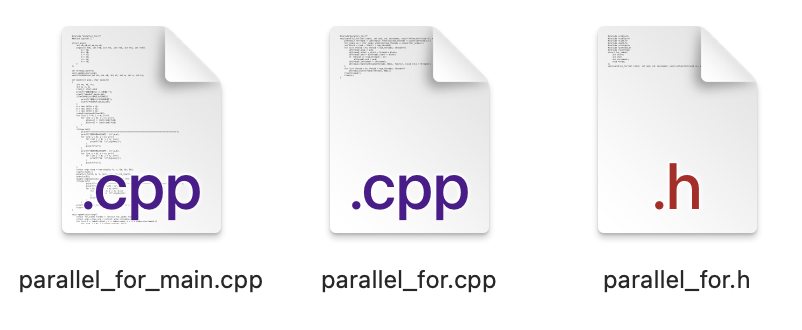
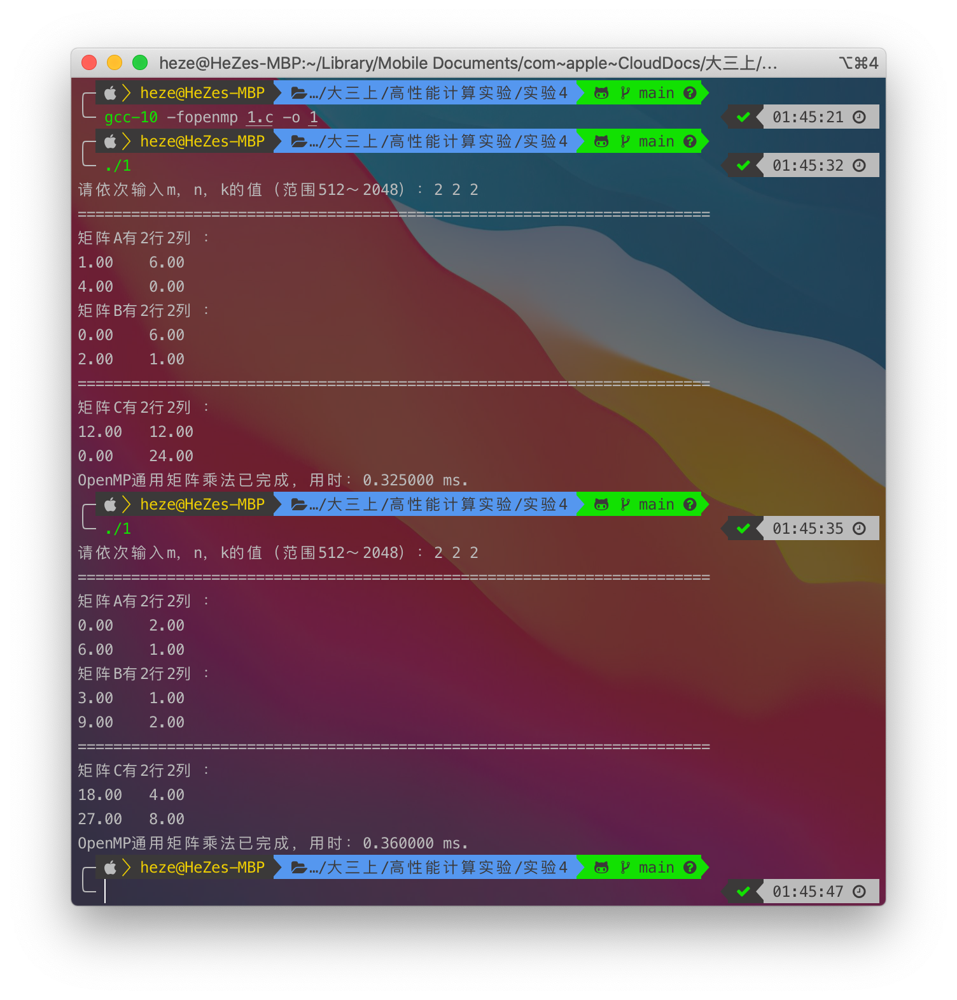
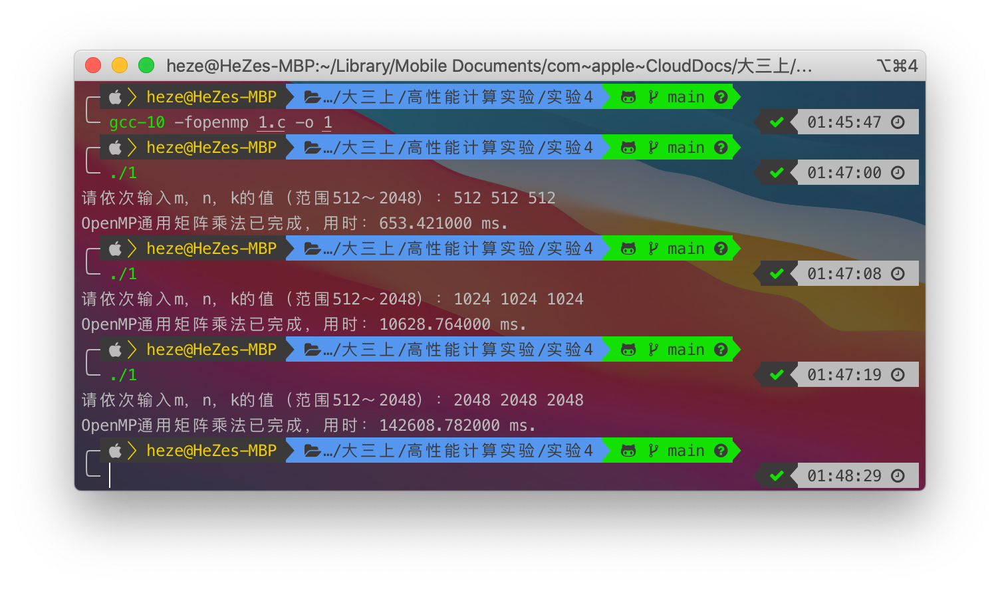
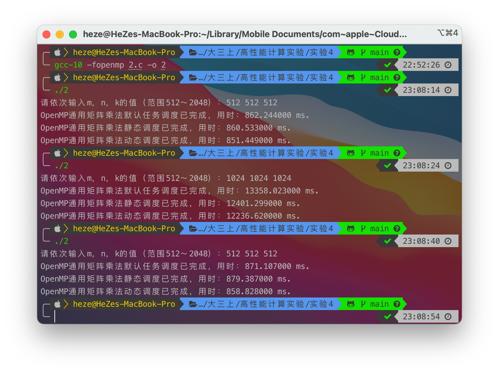
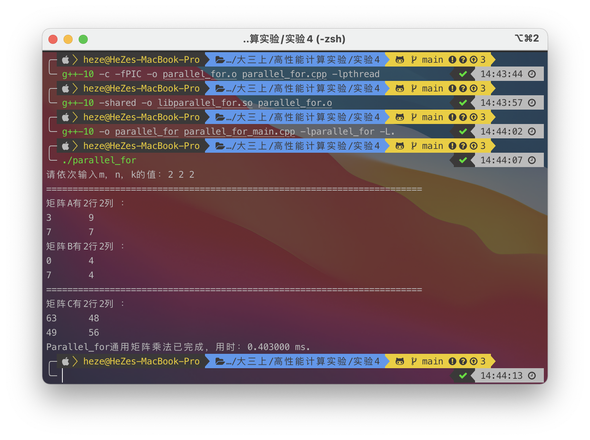

<h1 align=center>中山大学数据科学与计算机学院本科生实验报告</h1>

<h1 align=center>（2020 学年秋季学期）</h1>

   <h2 align=center>课程名称：高性能计算程序设计               任课教师：黄聃</h2>

| 年级+班级 |   18级计科（超算）   | 专业（方向） | 计算机科学与技术（超级计算方向） |
| :-------: | :------------------: | :----------: | :------------------------------: |
|   学号    |       18340052       |     姓名     |               何泽               |
|   Email   | heze_heze@icloud.com |   完成日期   |          2020年11月13日          |

 <h2 align=center>目录</h2>

[TOC]

# Ⅰ  实验目的

## 1. 通过 OpenMP 实现通用矩阵乘法

> 通过 OpenMP 实现通用矩阵乘法(Lab1)的并行版本，OpenMP并行进程从 1 增加至 8，矩阵规模从 512 增加至 2048
>
> 通用矩阵乘法(GEMM)通常定义为:
> $$
> C=AB\\
> C_{m,n}=\sum_{n=1}^NA_{m,n}B_{n,k}
> $$
> 输入：M , N, K 三个整数(512 ~2048)
>
> 问题描述：随机生成 M\*N 和 N*K 的两个矩阵 A,B,对这两个矩阵做乘法得到矩阵 C
>
> 输出：A,B,C 三个矩阵以及矩阵计算的时间

## 2. 基于 OpenMP 的通用矩阵乘法优化

> 分别采用 OpenMP 的默认任务调度机制、静态调度 `schedule(static, 1)` 和动态调度` schedule(dynamic,1)`的性能，实现`#pragma omp for`，并比较其性能。

## 3. 构造基于 Pthreads 的并行 for 循环分解、分配和执行机制。

> ① 基于 pthreads 的多线程库提供的基本函数，如线程创建、线程 join、线程同步等。构建` parallel_for `函数对循环分解、分 配和执行机制，函数参数包括但不限于(`int start, int end, int increment, void *(*functor)(void*), void *arg , int num_threads`);其中 `start` 为循环开始索引;`end `为结束索引; `increment `每次循环增加索引数;`functor `为函数指针，指向的需要被并行执行循环程块;`arg` 为 `functor `的入口参数; `num_threads `为并行线程数。
>
> ② 在 Linux 系统中将 `parallel_for` 函数编译为`.so `文件，由其他程序调用。
>
> ③ 将基于 OpenMP 的通用矩阵乘法的 `omp parallel for `并行，改造成基于 `parallel_for `函数并行化的矩阵乘法，注意只改造可被并行执行的 for 循环(例如无 race condition、无数据依赖、 无循环依赖等)。
>
> 举例说明：
>
> 将串行代码:
>
> ```c
> for ( int i = 0; i < 10; i++ ){
> 	A[i]=B[i] * x + C[i] 
> }
> ```
>
> 替换为：
>
> ```c
> parallel_for(0, 10, 1, functor, NULL, 2); 
> struct for_index {
>        int start;
>        int end;
>        int increment;
> }
> void * functor (void * args){
>     	struct for_index * index = (struct for_index *) args;
>     	for (int i = index->start; i < index->end; i = i + index->increment){
>         	A[i]=B[i] * x + C[i]; 
>     	}
> }
> ```
>
> 编译后执行阶段，多线程执行，在两个线程情况下:
>
> Thread0: start 和 end 分别为 0，5 
>
> Thread1: start 和 end 分别为 5，10
>
> ```c
> void * funtor(void * arg){
> 	int start = my_rank * (10/2);
>    	int end = start + 10/2; 
>    	for(int j = start, j < end, j++) 
>         	A[j]=B[j] * x + C[j];
> }
> ```

# Ⅱ   实验过程和核心代码

## 0. 代码整体说明

- 开头`#define isprint 0`这句话定义了一个宏，表示是否打印所有矩阵的元素，为0则不打印，只输出运行时间，为1则打印所有矩阵的所有元素

- 变量`m,n,k`分别代表三个矩阵的行数和列数；三个数组`a,b,c`，`a,b`为待乘矩阵，`c`为结果矩阵


## 1. 通过 OpenMP 实现通用矩阵乘法

### （1）算法简述

$$
C=AB \\
C_{m,n}=\sum_{n=1}^{N}A_{m,n}B_{n,k}
$$

### （2）串行版本

```c++
for (int i = 0; i < m;i++){
    for (int j = 0; j < n;j++){
        double sum = 0;
        for (int w = 0; w < k;w++)
            sum += a[i][w] * b[w][j];
        c[i][j] = sum;
    }
}
```

### （3） OpenMP并行化

```c
#pragma omp parallel for
for (int i = 0; i < m;i++){
#pragma omp parallel for privite(sum,w)
    for (int j = 0; j < n;j++){
        double sum = 0;
        for (int w = 0; w < k;w++)
            sum += a[i][w] * b[w][j];
        c[i][j] = sum;
    }
}
```

​	首先在第一个循环前使用子句`#pragma omp parallel for` 开始并行，第二个循环前为了避免数据竞争将变量`sum`和`w`声明为`private`，故使用子句`#pragma omp parallel for privite(sum,w)` ，这样就完成了并行化。

## 2. 基于 OpenMP 的通用矩阵乘法优化

> ​	代码框架和前面一致

### （1）默认调度

代码即和前面的一致

```c
#pragma omp parallel for
for (int i = 0; i < m;i++){
#pragma omp privite(sum,w) parallel for
    for (int j = 0; j < n;j++){
        double sum = 0;
        for (int w = 0; w < k;w++)
            sum += a[i][w] * b[w][j];
        c[i][j] = sum;
    }
}
```

### （2） 静态调度

即在`parallel for`后面加上`schedule(static,1)`

```c
#pragma omp parallel for schedule(static,1)
for (int i = 0; i < m;i++){
#pragma omp privite(sum,w) parallel for schedule(static,1)
    for (int j = 0; j < n;j++){
        double sum = 0;
        for (int w = 0; w < k;w++)
            sum += a[i][w] * b[w][j];
        c[i][j] = sum;
    }
}
```

### （2） 动态调度

即在`parallel for`后面加上`schedule(dynamic,1)`

```c
#pragma omp parallel for schedule(dynamic,1)
for (int i = 0; i < m;i++){
#pragma omp privite(sum,w) parallel for schedule(dynamic,1)
    for (int j = 0; j < n;j++){
        double sum = 0;
        for (int w = 0; w < k;w++)
            sum += a[i][w] * b[w][j];
        c[i][j] = sum;
    }
}
```

## 3.构造基于 Pthreads 的并行 for 循环分解、分配和执行机制

此任务共有三个文件：



其中`parallel_for.h`与`parallel_for.cpp`为库函数的头文件与实现，`parallel_for_main`为主函数

### （1） parallel_for.h

- 此文件为头文件，声明需要用到的库以及索引结构体与库函数的声明。

- `for_index`结构体传入每个块的开始、结束与递增量，因为 `pthread_create` 函数需要传入并行函数的参数，所以增加 void 型指针传参

```c
#include <cstdio>
#include <cstdlib>
#include <ctime>
#include <cmath>
#include <pthread.h>
#include <iostream>
struct for_index{
    int start;
    int end;
    int increment;
    void *args;
};
void parallel_for(int start, int end, int increment, void *(*functor)(void *), void *arg, int num_threads);
```

### （2） parallel_for.cpp

- 此函数为`.so`库函数的实现，即基于 pthreads 的多线程库提供的基本函数构建` parallel_for `函数对循环分解、分配和执行。
- `a`为每个线程对应的` for_index` 结构体
- `block`为每个线程需要执行的循环次数

```c
#include"parallel_for.h"
void parallel_for(int start, int end, int increment, void *(*functor)(void *), void *arg, int num_threads){
    pthread_t *threads = (pthread_t *)malloc(num_threads * sizeof(pthread_t));
    for_index *a = (for_index *)malloc(num_threads * sizeof(for_index));
    int block = (end - start) / num_threads;
    for (int thread = 0; thread < num_threads; thread++){
        a[thread].args = arg;
        a[thread].start = start + thread * block;
        a[thread].end = a[thread].start + block;
        if (thread == (num_threads - 1))
            a[thread].end = end;
        a[thread].increment = increment;
        pthread_create(&threads[thread], NULL, functor, (void *)(a + thread));
    }
    for (int thread = 0; thread < num_threads; thread++)
        pthread_join(threads[thread], NULL);
    free(threads);
    free(a);
}
```

### （3）parallel_for_main.cpp

- 此函数为主函数，将基于 OpenMP 的通用矩阵乘法的 `omp parallel for `并行，改造成基于 `parallel_for `函数并行化的矩阵乘法。

- 整体代码框架和任务一类似，只是将GEMM通用矩阵乘法进行更改并写成一个独立的函数，在main函数调用以通过`parallel_for`函数并行化。

- 首先开头需要引入头文件： `#include "parallel_for.h"`

- 然后将需要调用的参数写成一个结构体

    ```c
    struct args{
        int *A,*B,*C,*m,*n,*k;
        args(int *tA, int *tB, int *tC, int *tm, int *tn, int *tk){
            A = tA;
            B = tB;
            C = tC;
            m = tm;
            n = tn;
            k = tk;
        }
    };
    ```

- GEMM函数更改后如下：

    ```c
    void *gemm(void *arg){
        struct for_index *index = (struct for_index *)arg;
        struct args *true_arg = (struct args *)(index->args);
        for (int i = index->start; i < index->end; i = i + index->increment){
            for (int j = 0; j < *true_arg->k; ++j){
                int temp = 0;
                for (int z = 0; z < *true_arg->n; ++z)
                    temp += true_arg->A[i * (*true_arg->n) + z] * true_arg->B[z * (*true_arg->k) + j];
                true_arg->C[i * (*true_arg->k) + j] = temp;
            }
        }
        return NULL;
    }
    ```

- main函数整体框架与前面一致，只是乘法调用改成如下形式：

    ```c
    parallel_for(0, m, 1, gemm, arg, thread_count);
    ```

这样，便完成了通过调用`parallel_for`的`.so`函数库实现矩阵乘法，生成动态链接库的过程描述详见“实验结果”

# Ⅲ  实验结果

## 1. 通过 OpenMP 实现通用矩阵乘法

### （1） 验证算法正确性

打印所有矩阵元素，可以通过手算证明结果是正确的



### （2） 扩大维数



## 2. 基于 OpenMP的通用矩阵乘法优化

三种调度方式结果如下：



可以看到，其实三种调度方式的时间大体上差不多，动态调度的时间会稍稍少一些，在我看来是因为生成的矩阵元素都差不多，CPU执行并不会因为不同的数字而产生太大的差距，CPU负载较为平均，这就导致其实各种调度的运行时间不会有太大差别；而由于动态调度会使负载更为平均，所以时间会稍微少一些。


## 3. 构造基于 Pthreads 的并行 for 循环分解、分配和执行机制

### （1） 生成动态链接库

- 首先编译`parallel_for.cpp`

    ```shell
    g++-10 -c -fPIC -o parallel_for.o parallel_for.cpp -lpthread
    ```

    - `-c`表示只编译而不连接
    - `-o`选项用于说明输出文件名
    - `-fPIC`表示编译为位置独立的代码；不用此选项的话编译后的代码是位置相关的，因此动态载入时是经过代码拷贝的方式来满足不一样进程的需要，而不能达到真正代码段共享的目的
    - 此步骤将生成`parallel_for.o`

- 生成`.so`动态链接库

    ```shell
    g++-10 -shared -o libparallel_for.so parallel_for.o
    ```

    - `-shared`表示生成一个动态链接库（让链接器生成T类型的导出符号表，有时候也生成弱链接W类型的导出符号），不用该标志外部程序没法链接至一个可执行文件

### （2） 载入动态链接库

- 为了使用动态链接库，编译器需要知道`.h`文件位置

    - 对于`#include "..."`，编译器会在当前路径搜索`.h`文件，也可以使用`-I`选项提供额外的搜索路径
    - 对于`#include <...>`，编译器会在默认`include`搜索路径中寻找

- 编译器还需要知道我们用了哪个库文件，在`g++`中：

    - 使用`-l`选项说明库文件的名字（库文件名开头去掉`lib`）
    - 使用`-L`选项说明库文件所在的路径（这里我使用了`-L. `表示当前路径）
    - 如果没有`-L`选项，`g++`将在默认库文件搜索路径中寻找

- 因为我的链接库和头文件都在同一目录下，所以我的编译命令如下：

    ```shell
    g++-10 -o parallel_for parallel_for_main.cpp -lparallel_for -L.
    ```

之后便可正常运行

### （3） 运行

使用以上命令生成链接库并使用、运行截图如下：



可以看到结果正确，可见动态链接库生成成功，可以正常调用运行。

# Ⅳ  实验感想

此次实验熟悉了OpenMP的编程方法，但是由于矩阵乘法这个例子的CPU负载较为平均，所以三种调度对性能并没有什么显著对差距，之后通过使用Pthread实现类似OpenMP的`parallel for`更加熟悉了Pthread的编程方法与生成动态链接库的操作。

