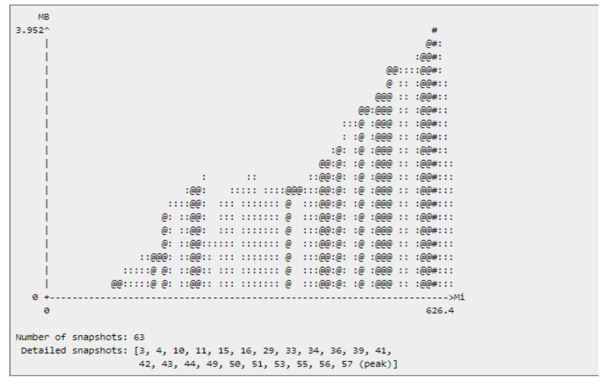
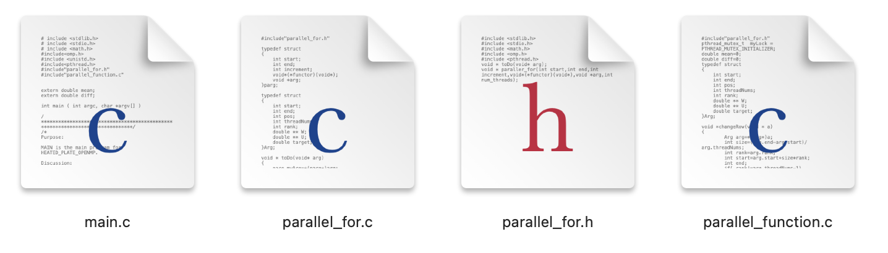
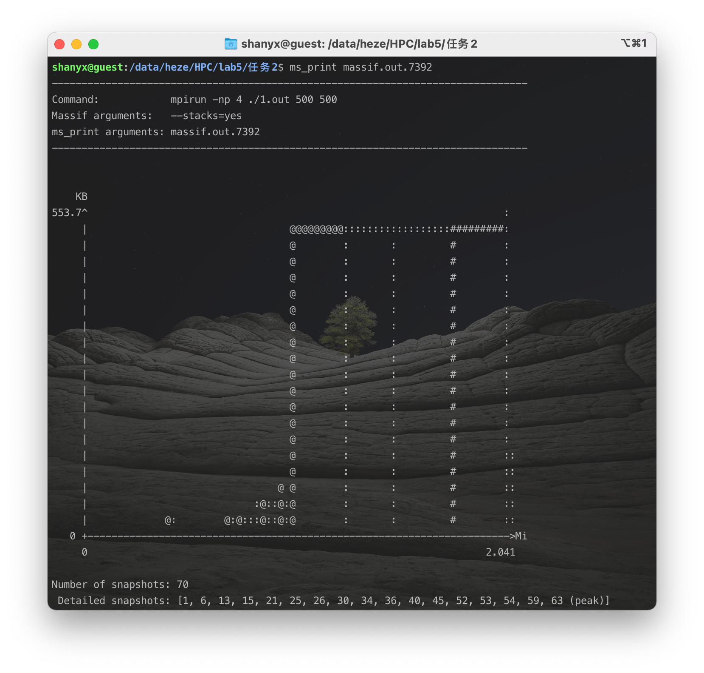

<h1 align=center>中山大学数据科学与计算机学院本科生实验报告</h1>

<h1 align=center>（2020 学年秋季学期）</h1>

<h1 align=center>高性能计算实验五</h1>

   <h2 align=center>课程名称：高性能计算程序设计               任课教师：黄聃</h2>

| 年级+班级 |   18级计科（超算）   | 专业（方向） | 计算机科学与技术（超级计算方向） |
| :-------: | :------------------: | :----------: | :------------------------------: |
|   学号    |       18340052       |     姓名     |               何泽               |
|   Email   | heze_heze@icloud.com |   完成日期   |          2020年12月5日           |

 <h2 align=center>目录</h2>

[TOC]

# Ⅰ  实验目的

## 1. 基于 Pthreads 的 parallel_for 函数替换omp parallel for

> 通过实验 4 构造的基于 Pthreads 的 `parallel_for` 函数替 换 `heated_plate_openmp` 应用中的“`omp parallel for`” , 实现 for 循环分解、分配和线程并行执行。

## 2. 基于 MPI替换omp parallel for

> 将 `heated_plate_openmp` 应用改造成基于 MPI 的进程并 行 应 用 。 Bonus: 使 用 `MPI_Pack`/`MPI_Unpack `， 或 `MPI_Type_create_struct` 实现数据重组后的消息传递。

## 3. 性能比较

> 性能分析任务 1、任务 2 和 `heated_plate_openmp` 应用， 包括:
>
> 1. 不同问题规模的 `heated_plate` 应用并行执行时间对 比，其中问题规模定义为 plate 为正方形，长宽相等，边长(M=N)变化范围 250，500，1000，2000;并行 规模为 1，2，4，8 进/线程。
>
> 2. 内存消耗对比， 存消耗采用 “`valgrind massif`”工具采集，注意命令 `valgrind` 命令中增加`--stacks=yes`参数采集程序运行栈 内内存消耗。`Valgrind massif `输出日志 (`massif.out.pid`)经过 `ms_print `打印后示例如下图， 其中 x 轴为程序运行时间，y 轴为内存消耗量:
>
>     
>
> 
>
> 参考文献:
>
> - Valgrind massif:
>
>     https://valgrind.org/docs/manual/ms-manual.html
>
> - Heated_plate_openmp 源代码:
>
>     https://people.sc.fsu.edu/~jburkardt/c_src/heated_plate_openmp/heated_plate_openmp.c
>
> - Heated_plate_openmp 介绍:
>
>     https://people.sc.fsu.edu/~jburkardt/c_src/heated_plate_openmp/heated_plate_openmp.html

# Ⅱ   实验过程和核心代码

## 1. 基于 Pthreads 的 parallel_for 函数替换omp parallel for

- 和实验4类似，共有以下四个文件：

    

    - `parallel_for.h`与`parallel_for.c`为库函数的头文件与实现
    - `main.c`为主函数
    - `parallel_function.c`为主函数中pthread调用的函数的实现

### ①  parallel_for.h

此文件为头文件，声明需要用到的库以及结构体与库函数的声明

```c
#include <stdlib.h>
#include <stdio.h>
#include <math.h>
#include <omp.h>
#include <pthread.h>
typedef struct{
	int start;
	int end;
	int pos;
	int threadNums;
	int rank;
	double ** W;
	double ** U;
	double target; 
}Arg;
typedef struct{
	int start;
	int end;
	int increment;
	void*(*functor)(void*);
	void *arg;
}parg;
void * toDo(void* arg){
	parg myArg=*(parg*)arg;
	for(int i=myArg.start;i<myArg.end;i+=myArg.increment){
		(*myArg.functor)(myArg.arg);
	}
}
void * paraller_for(int start,int end,int increment,void*(*functor)(void*),void *arg,int num_threads); 
```

### ②   parallel_for.c

此函数为`.so`库函数的实现，即基于 pthreads 的多线程库提供的基本函数构建` parallel_for `函数对循环分解、分配和执行

```c
#include"parallel_for.h"
void * paraller_for(int start,int end,int increment,void*(*functor)(void*),void *arg,int num_threads){
	if((end-start)/(increment*num_threads)<1)
		num_threads=(end-start)/increment;
	pthread_t  thread_handles[num_threads];
	Arg args[num_threads];
	for(int i=0;i<num_threads;i++){
		args[i]=*(Arg*)arg;
		args[i].rank=i;
	}
	parg tmp[num_threads];
	int local_size=(end-start)/num_threads;
	for(int i=0;i<num_threads-1;i++){
		tmp[i].start=i*local_size;
		tmp[i].end=tmp[i].start+local_size;
		tmp[i].increment=increment;
		tmp[i].arg=(void*)&args[i];
		tmp[i].functor=functor;
		pthread_create(&thread_handles[i],NULL,toDo,(void*)&tmp[i]);
	}
	tmp[num_threads-1].start=(num_threads-1)*local_size;
	tmp[num_threads-1].end=end;
	tmp[num_threads-1].increment=increment;
	tmp[num_threads-1].arg=(void*)&args[num_threads-1];
	tmp[num_threads-1].functor=functor;
	pthread_create(&thread_handles[num_threads-1],NULL,toDo,(void*)&tmp[num_threads-1]);
	for(int i=0;i<num_threads;i++)
		pthread_join(thread_handles[i],NULL);
}
```

### ③  parallel_function.c

- 为主函数中pthread调用的函数的实现，由于有一定重复性，下面对几个有代表性的进行说明

- 将W矩阵复制到U矩阵：

    ```c
    void *copy(void *a){
        Arg arg=*(Arg*)a;
        int size=(arg.end-arg.start)/arg.threadNums;
        int rank=arg.rank;
        int start=arg.start+size*rank;
        int end;
        if( rank!=arg.threadNums-1)
            end=start+size;
        else
            end=arg.end;
        for(int i=start;i<end;i++)
            for(int j=0;j<arg.pos;j++)
                arg.U[i][j]=arg.W[i][j];
    }
    ```

- 计算平均值：

    ```c
    void * compute(void *a){
        Arg arg=*(Arg*)a;
        int size=(arg.end-arg.start)/arg.threadNums;
        int rank=arg.rank;
        int start=arg.start+size*rank;
        int end;
        double **w=arg.W;
        double **u=arg.U;
        if( rank!=arg.threadNums-1)
            end=start+size;
        else
            end=arg.end;
        for(int i=start;i<end;i++)
            for(int j=1;j<arg.pos;j++)
                w[i][j] = ( u[i-1][j] + u[i+1][j] + u[i][j-1] + u[i][j+1] ) / 4.0;
    }
    ```

- 计算差值

    ```c
    void * Diff(void *a){
        int key1,key2;
        Arg arg=*(Arg*)a;
        int size=(arg.end-arg.start)/arg.threadNums;
        int rank=arg.rank;
        int start=arg.start+size*rank;
        int end;
        double **w=arg.W;
        double **u=arg.U;
        if( rank!=arg.threadNums-1)
            end=start+size;
        else
            end=arg.end;
        double myDiff=0.0;
        for(int i=start;i<end;i++){
            for(int j=1;j<arg.pos;j++){
                  if(myDiff<fabs(w[i][j]-u[i][j])){
                      myDiff=fabs(w[i][j]-u[i][j]);
                      key1=i;
                      key2=j;
                  }
            }
        }
        pthread_mutex_lock(&myLock);
        if ( diff < myDiff )
            diff = myDiff;
        pthread_mutex_unlock(&myLock);
    }
    ```

### ④  main.c

- 主函数，在提供的代码上修改

- 首先，M、N的值和线程数由运行时输入的参数argv数组赋值

- 之后便是将使用`omp parallel for`的地方替换成`parallel for`函数

- 因为结构都相同，这里只举复制矩阵这一个例子：

    ```c
    arg.start=0;
    arg.end=M;
    arg.pos=N;
    arg.W=w;
    arg.U=u;
    paraller_for(0,threadNums,1,copyMat,(void*)&arg,threadNums);
    ```

## 2. 基于 MPI替换omp parallel for

- 这里使用了`MPI_Pack`/`MPI_Unpack `

- 主进程：

    ```c
    for (int i = 0; i < M; i++ ){
        for (int j = 0; j < N; j++ ) 
            u[i][j] = w[i][j]; 
    for(int i=1;i<=comm_sz-1;i++){ 
        int start=1+(i-1)*size; 
        int pos=0; 
        int end; 
        if(i!=comm_sz-1) 
            end=start+size; 
        else 
            end=M-1; 
        for(int j=start-1;j<end+1;j++) 
            MPI_Pack(u[j],N,MPI_DOUBLE,buf,sizeof(double)*((size+4)*N),&pos,MPI_COMM_WORLD); 
        MPI_Send(buf,pos,MPI_PACKED,i,0,MPI_COMM_WORLD); 
    }
    for(int i=1;i<comm_sz;i++) { 
        int pos=0; 
        MPI_Recv(buf,sizeof(double)*((size+4)*N),MPI_PACKED,i,0,MPI_COMM_WORLD,MPI_STATUS_IGNORE); 
        MPI_Unpack(buf,sizeof(double)*((size+4)*N),&pos,&di[i],1,MPI_DOUBLE,MPI_COMM_WORLD); 
        int start=1+(i-1)*size,rows; 
        if(i!=comm_sz-1) 
            rows=size; 
        else 
            rows=M-1-start; 
        int j=start; 
        for(int i=0;i<rows;i++) {
            MPI_Unpack(buf,sizeof(double)*((size+4)*N),&pos,w[j],N,MPI_DOUBLE,MPI_COMM_WORLD); 
            j++; 
        } 
    }
    ```

- 子线程：

    ```c
    MPI_Recv(buf,sizeof(double)*((size+4)*N),MPI_PACKED,0,0,MPI_COMM_WORLD,MPI_STATUS_IGNORE); 		
    int ros,pos=0,start=1+(my_rank-1)*size; 
    if(my_rank!=comm_sz-1) 
        rows=size+2; 
    else 
        rows=M-start+1; 
    for(int i=0;i<rows;i++) 
        MPI_Unpack(buf,sizeof(double)*((size+4)*N),&pos,tmpU[i],N,MPI_DOUBLE,MPI_COMM_WORLD); 
    for(int i=1;i<rows-1;i++) {
        for(int j=1;j<N-1;j++)
            tmpW[i][j]=( tmpU[i-1][j] + tmpU[i+1][j] + tmpU[i][j-1] + tmpU[i][j+1] ) / 4.0; 
        tmpW[i][0]=tmpW[i][N-1]=100; 
    }
    diff=0; 
    for (int i = 1; i < rows - 1; i++ ) { 
        for (int j = 1; j < N - 1; j++ ) { 
            if ( diff < fabs ( tmpW[i][j] - tmpU[i][j] ) ) 
                diff = fabs ( tmpW[i][j] - tmpU[i][j] ); 
        } 
    }
    pos=0; 
    MPI_Pack(&diff,1,MPI_DOUBLE,buf,sizeof(double)* ((size+4)*N),&pos,MPI_COMM_WORLD); 
    for (int i = 1; i < rows - 1; i++ ) 
        MPI_Pack(tmpW[i],N,MPI_DOUBLE,buf,sizeof(double)* ((size+4)*N),&pos,MPI_COMM_WORLD); 
    MPI_Send(buf,pos,MPI_PACKED,0,0,MPI_COMM_WORLD);
    ```

# Ⅲ  实验结果

## 0. heated_plate_openmp

首先运行原本给出的代码，以便结果比较：


## 1. 基于 Pthreads 的 parallel_for 函数替换omp parallel for

### （1） 生成动态链接库

- 首先编译`parallel_for.cpp`

    ```shell
    gcc -c -fPIC -o parallel_for.o parallel_for.c -lpthread
    ```

    - `-c`表示只编译而不连接
    - `-o`选项用于说明输出文件名
    - `-fPIC`表示编译为位置独立的代码；不用此选项的话编译后的代码是位置相关的，因此动态载入时是经过代码拷贝的方式来满足不一样进程的需要，而不能达到真正代码段共享的目的
    - 此步骤将生成`parallel_for.o`

- 生成`.so`动态链接库

    ```shell
    gcc -shared -o libparallel_for.so parallel_for.o
    ```

    - `-shared`表示生成一个动态链接库（让链接器生成T类型的导出符号表，有时候也生成弱链接W类型的导出符号），不用该标志外部程序没法链接至一个可执行文件

### （2） 载入动态链接库

- 为了使用动态链接库，编译器需要知道`.h`文件位置

    - 对于`#include "..."`，编译器会在当前路径搜索`.h`文件，也可以使用`-I`选项提供额外的搜索路径
    - 对于`#include <...>`，编译器会在默认`include`搜索路径中寻找

- 编译器还需要知道我们用了哪个库文件，在`g++`中：

    - 使用`-l`选项说明库文件的名字（库文件名开头去掉`lib`）
    - 使用`-L`选项说明库文件所在的路径（这里我使用了`-L. `表示当前路径）
    - 如果没有`-L`选项，`g++`将在默认库文件搜索路径中寻找

- 因为我的链接库和头文件都在同一目录下，所以我的编译命令如下：

    ```shell
    gcc -o parallel_for main.c -lparallel_for -L.
    ```

之后便可正常运行

### （3） 运行

使用以上命令生成链接库并使用、运行截图如下：


与上面的结果比较可以看到结果一致，可见改写正确。

## 2. 基于 MPI替换omp parallel for


结果也一致。

## 3. 性能比较

> **前言：**
>
> 因为我的电脑是macOS系统，没有办法装 “`valgrind massif`”工具，所以我使用了一台服务器去跑，但是有以下这个问题：
>
> 不知是服务器的问题还是软件的问题，正常运行没有问题，但是使用valgrind工具的时候即使指定使用8个线程，但是在实际运行的时候通过htop查看资源占用发现实际只用了一至两个CPU核心去运行，如下图所示：
>
> 
>
> 可以看到CPU占用是166%，我不确定这对最后的结果有没有影响

### ①  时间比较（秒为单位）

- 线程数为1

    |      大小      | 250  | 500  | 1000 | 2000 |
    | :------------: | :--: | :--: | :--: | :--: |
    | 任务1：pthread |  45  | 364  | 1731 | 5023 |
    |   任务2：mpi   |  63  | 873  | 5968 | 8984 |

- 线程数为2

    |      大小      | 250  | 500  | 1000 | 2000 |
    | :------------: | :--: | :--: | :--: | :--: |
    | 任务1：pthread |  24  | 208  | 863  | 3297 |
    |   任务2：mpi   |  29  | 563  | 2467 | 5236 |


- 线程数为4

    |      大小      | 250  | 500  | 1000 | 2000 |
    | :------------: | :--: | :--: | :--: | :--: |
    | 任务1：pthread |  19  | 164  | 522  | 2061 |
    |   任务2：mpi   |  35  | 398  | 3652 | 6335 |


- 线程数为8

    |      大小      | 250  | 500  | 1000 | 2000 |
    | :------------: | :--: | :--: | :--: | :--: |
    | 任务1：pthread |  12  | 126  | 397  | 1428 |
    |   任务2：mpi   |  41  | 627  | 6693 | 7089 |

可以看出，mpi是要比pthread慢很多的，而且随着线程数的增加，运行时间先减少再增加，这可能是mpi的线程间通信的开销过大，所以导致了时间变长。

### ②  内存消耗对比

- 无修改原openmp版本

    - 运行valgrind：

      
    
    - ms_print打印：
    
        
    
- 任务1 Pthread版本：

    - 运行valgrind：

        

    - ms_print打印：

        

- 任务2 MPI版本：

    

可以看到，mpi占用的内存要比pthread小得多

# Ⅳ  实验感想

此次实验通过使用Pthread和MPI分别实现类似OpenMP的`parallel for`，更加熟悉了这几种并行编程方法以及底层的实现原理。

