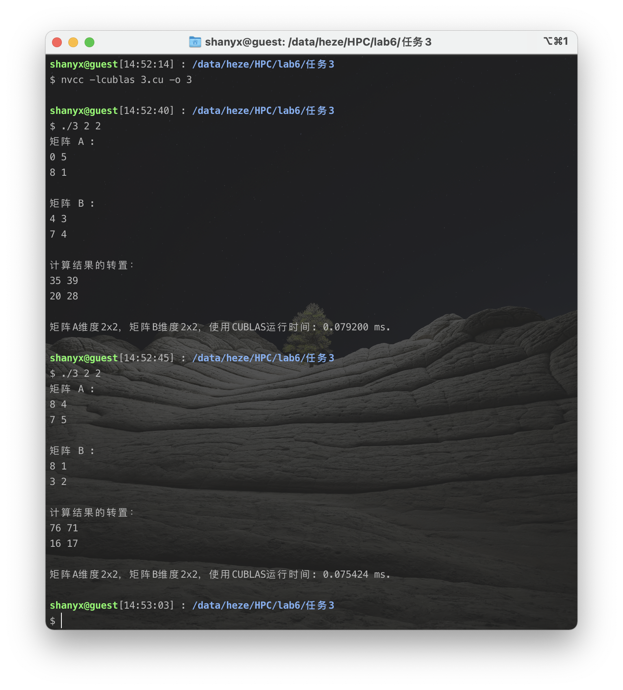

<h1 align=center>中山大学数据科学与计算机学院本科生实验报告</h1>

<h1 align=center>（2020 学年秋季学期）</h1>

<h1 align=center>实验六</h1>

   <h2 align=center>课程名称：高性能计算程序设计               任课教师：黄聃</h2>

| 年级+班级 |   18级计科（超算）   | 专业（方向） | 计算机科学与技术（超级计算方向） |
| :-------: | :------------------: | :----------: | :------------------------------: |
|   学号    |       18340052       |     姓名     |               何泽               |
|   Email   | heze_heze@icloud.com |   完成日期   |          2020年12月15日          |

 <h2 align=center>目录</h2>

[TOC]

# Ⅰ  实验目的

## 1. 通过 CUDA 实现通用矩阵乘法

> 通过CUDA实现通用矩阵乘法（Lab1）的并行版本，CUDA Thread Block size从32增加至512，矩阵规模从512增加至8192。
>
> 通用矩阵乘法（GEMM）通常定义为：
> $$
> C=AB \\
> C_{m,n}=\sum_{n=1}^{N}A_{m,n}B_{n,k}
> $$
> 
>
> 输入：M , N, K三个整数（512 ~8192）
>
> 问题描述：随机生成M\*N和N\*K的两个矩阵A,B,对这两个矩阵做乘法得到矩阵C。
>
> 输出：A,B,C三个矩阵以及矩阵计算的时间a

## 2. 改造成基于OpenMP+CUDA的多层次并行矩阵乘法

>将任务1改造成基于OpenMP+CUDA的多层次并行矩阵乘法。矩阵被主进程切分成子矩阵分配给OpenMP并行线程计算，并行进程调用任务1的CUDA版本矩阵乘法计算子矩阵，汇总并行进程的计算结果，并打印结果和运行时间，并行线程数：1，2，4，8。

## 3. 通过CUBLAS计算矩阵相乘

> 通过NVDIA的矩阵计算函数库CUBLAS计算矩阵相乘，矩阵规模从512增加至8192，并与任务1和任务2的矩阵乘法进行性能比较和分析，如果性能不如CUBLAS，思考并文字描述可能的改进方法（参考《计算机体系结构-量化研究方法》第四章）。
>
> CUBLAS参考资料《CUBLAS_Library.pdf》，CUBLAS矩阵乘法参考第70页内容。
>
> CUBLAS矩阵乘法例子，参考附件《matrixMulCUBLAS》

# Ⅱ   实验过程和核心代码

## 1. 通过 CUDA 实现通用矩阵乘法

### （1）算法简述

$$
C=AB \\
C_{m,n}=\sum_{n=1}^{N}A_{m,n}B_{n,k}
$$

### （2） 前置结构说明

- 首先，矩阵维度m,n,k三个参数和CUDA的block_size由运行时输入参数argv列表获得

    ```c
    int block_size=atoi(argv[1]);
    int m=atoi(argv[2]);
    int n=atoi(argv[3]);
    int k=atoi(argv[4]);
    ```

- 我写了2个版本，一个是使用CPU运行的GEMM，另一个是使用CUDA的，在验证结果的正确性的时候，我在两个都运行完成之后比较两个的结果，如果相同则会输出加速比，如果不同则打印结果错误。

- 计时我使用的是`cudaEventRecord`记录

    ```c++
    float time;
    cudaEvent_t start, stop;
    cudaEventCreate(&start);
    cudaEventCreate(&stop);
    cudaEventRecord(start, 0);
    //在这里计算
    cudaEventRecord(stop, 0);
    cudaEventSynchronize(stop);
    cudaEventElapsedTime(&time, start, stop);
    ```

    上面的代码中最后的time即为程序运行时间。

### （3）CPU版本——串行版本

```c++
void gemm_cpu(double *host_a, double *host_b, double *host_result, int m, int n, int k) 
{
    for (int i = 0; i < m; i++) {
        for (int j = 0; j < k; j++) {
            double tmp = 0.0;
            for (int h = 0; h < n; h++) {
                tmp += host_a[i * n + h] * host_b[h * k + j];
            }
            host_result[i * k + j] = tmp;
        }
    }
}
```

### （3） CUDA版本

#### ①核函数

```c
__global__ void gemm_gpu(double *a,double *b, double *c, int m, int n, int k)
{ 
    int row = blockIdx.y * blockDim.y + threadIdx.y; 
    int col = blockIdx.x * blockDim.x + threadIdx.x;
    double tmp = 0;
    if( col < k && row < m) {
        for(int i = 0; i < n; i++) {
            tmp += a[row * n + i] * b[i * k + col];
        }
        c[row * k + col] = tmp;
    }
}
```

**可以看到，我并不是按照正常的思路将block的x作为行y作为列，而是反过来y作为行x作为列，这样做是因为考虑到了CUDA的访存优化，经过实际测试这样做会快5-10倍。**

#### ②main函数

- 首先，使用`cudaMallocHost`函数在CPU上分配空间

    ```c
    cudaMallocHost((void **) &host_a, sizeof(double)*m*n);
    cudaMallocHost((void **) &host_b, sizeof(double)*n*k);
    cudaMallocHost((void **) &host_c_gpu, sizeof(double)*m*k);
    cudaMallocHost((void **) &host_c_cpu, sizeof(double)*m*k);
    ```

- 矩阵元素随机赋值

    ```c
    srand((unsigned)time(0));
    for (int i = 0; i < m; ++i) {
        for (int j = 0; j < n; ++j) {
            host_a[i * n + j] = (double)rand() / (double)(RAND_MAX)*1e4;
        }
    }
    for (int i = 0; i < n; ++i) {
        for (int j = 0; j < k; ++j) {
            host_b[i * k + j] = (double)rand() / (double)(RAND_MAX)*1e4;
        }
    }
    ```

- 在GPU分配空间（先在CPU上分配，之后拷贝到GPU）

    ```c
    cudaMalloc((void **) &device_a, sizeof(double)*m*n);
    cudaMalloc((void **) &device_b, sizeof(double)*n*k);
    cudaMalloc((void **) &device_c, sizeof(double)*m*k);
    cudaMemcpy(device_a, host_a, sizeof(double)*m*n, cudaMemcpyHostToDevice);
    cudaMemcpy(device_b, host_b, sizeof(double)*n*k, cudaMemcpyHostToDevice);
    ```

- 定义`dimGrid`和`dimBlock`

    ```c
    unsigned int grid_rows = (m + block_size - 1) / block_size;
    unsigned int grid_cols = (k + block_size - 1) / block_size;
    dim3 dimGrid(grid_cols, grid_rows);
    dim3 dimBlock(block_size, block_size);
    ```

- 调用核函数计算

    ```c
    gemm_gpu<<<dimGrid, dimBlock>>>(device_a, device_b, device_c, m, n, k);
    ```

- 将结果拷贝回来

    ```c
    cudaMemcpy(host_c_gpu, device_c, sizeof(double)*m*k, cudaMemcpyDeviceToHost);
    cudaThreadSynchronize();
    ```

- 最后释放内存

    ```c
    cudaFree(device_a);
    cudaFree(device_b);
    cudaFree(device_c);
    cudaFreeHost(host_a);
    cudaFreeHost(host_b);
    cudaFreeHost(host_c_gpu);
    cudaFreeHost(host_c_cpu);
    ```

## 2. 改造成基于OpenMP+CUDA的多层次并行矩阵乘法

- 总体思路是在主函数中将使用OpenMP两个矩阵都分为4块，分块计算完成之后再汇总

- 对每一小块进行计算的函数，调用了前面的核函数

    ```c
    void mul_one_block (int upperOfRow,int bottomOfRow,int leftOfCol,int rightOfCol,int transLeft,int transRight)
    {
        int mm=bottomOfRow-upperOfRow;
        int nn=rightOfCol-leftOfCol;
        int kk=transRight-transLeft;
        cudaMalloc((void **) &device_a, sizeof(double)*mm*nn);
        cudaMalloc((void **) &device_b, sizeof(double)*nn*kk);
        cudaMalloc((void **) &device_c, sizeof(double)*mm*kk);
        cudaMemcpy(device_a, host_a, sizeof(double)*mm*nn, cudaMemcpyHostToDevice);
        cudaMemcpy(device_b, host_b, sizeof(double)*nn*kk, cudaMemcpyHostToDevice);
    
        unsigned int grid_rows = (mm + block_size - 1) / block_size/threads;
        unsigned int grid_cols = (kk + block_size - 1) / block_size/threads;
        dim3 dimGrid(grid_cols, grid_rows);
        dim3 dimBlock(block_size, block_size);
        gemm_gpu<<<dimGrid, dimBlock>>>(device_a, device_b, device_c, mm, nn, kk);
    
        cudaMemcpy(host_c_gpu, device_c, sizeof(double)*mm*kk, cudaMemcpyDeviceToHost);
        cudaThreadSynchronize();
    }
    ```

- 分块，并在计算完成后将计算结果汇总成一个大矩阵，调用了前面的`mul_one_block`对小矩阵进行计算

    ```c
    void omp_plus_cuda(int upperOfRow,int bottomOfRow,int leftOfCol,int rightOfCol,int transLeft,int transRight)
    {
        if ( ( bottomOfRow - upperOfRow ) < m/2 ) 
            mul_one_block (int upperOfRow,int bottomOfRow,int leftOfCol,int rightOfCol,int transLeft,int transRight);
        else{
    #pragma omp task{
            matrixMulti( upperOfRow , ( upperOfRow + bottomOfRow ) / 2 ,leftOfCol , ( leftOfCol + rightOfCol ) / 2 ,transLeft , ( transLeft + transRight ) / 2 );
            matrixMulti( upperOfRow , ( upperOfRow + bottomOfRow ) / 2 ,leftOfCol , ( leftOfCol + rightOfCol ) / 2 ,( transLeft + transRight ) / 2 + 1 , transRight );
            }
    #pragma omp task{
            matrixMulti( upperOfRow , ( upperOfRow + bottomOfRow ) / 2 ,( leftOfCol + rightOfCol ) / 2 + 1 , rightOfCol ,transLeft , ( transLeft + transRight ) / 2 );
            matrixMulti( upperOfRow , ( upperOfRow + bottomOfRow ) / 2 ,( leftOfCol + rightOfCol ) / 2 + 1 , rightOfCol ,( transLeft + transRight ) / 2 + 1 , transRight );
            }
    #pragma omp task{
            matrixMulti( ( upperOfRow + bottomOfRow ) / 2 + 1 , bottomOfRow ,leftOfCol , ( leftOfCol + rightOfCol ) / 2 ,transLeft , ( transLeft + transRight ) / 2 );
            matrixMulti( ( upperOfRow + bottomOfRow ) / 2 + 1 , bottomOfRow ,leftOfCol , ( leftOfCol + rightOfCol ) / 2 ,( transLeft + transRight ) / 2 + 1 , transRight );
            }
    #pragma omp task{
            matrixMulti( ( upperOfRow + bottomOfRow ) / 2 + 1 , bottomOfRow ,( leftOfCol + rightOfCol ) / 2 + 1 , rightOfCol ,transLeft , ( transLeft + transRight ) / 2 );
            matrixMulti( ( upperOfRow + bottomOfRow ) / 2 + 1 , bottomOfRow ,( leftOfCol + rightOfCol ) / 2 + 1 , rightOfCol ,( transLeft + transRight ) / 2 + 1 , transRight );
            }
    #pragma omp taskwait
        }
    }
    ```

## 3.通过CUBLAS计算矩阵相乘

- 头文件包含`cublas_v2.h`

    ```c
    #include "cublas_v2.h"
    ```

- 定义状态变量

    ```c
    cublasStatus_t status;
    ```

- 为矩阵分配空间

    ```c
    double *host_A = (double*)malloc (N*M*sizeof(double));
    double *host_B = (double*)malloc (N*M*sizeof(double));
    double *host_C = (double*)malloc (M*M*sizeof(double));
    ```

- 随机赋值

    ```c
    srand((unsigned)time(0));
    for (int i=0; i<N*M; i++) {
        host_A[i] = (double)rand() / (double)(RAND_MAX)*1e4;
        host_B[i] = (double)rand() / (double)(RAND_MAX)*1e4;
    }
    ```

- 创建并初始化 CUBLAS 库对象

    ```c
    cublasHandle_t handle;
    status = cublasCreate(&handle);
    if (status != CUBLAS_STATUS_SUCCESS){
        if (status == CUBLAS_STATUS_NOT_INITIALIZED) {
            cout << "CUBLAS 对象实例化出错" << endl;
        }
        return EXIT_FAILURE;
    }
    ```

- 在显存中分配空间

    ```c
    cudaMalloc ((void**)&device_A,N*M * sizeof(double));
    cudaMalloc ((void**)&device_B,N*M * sizeof(double));
    cudaMalloc ((void**)&device_C,M*M * sizeof(double));
    ```

- 使用`cublasSetVector`函数将2个矩阵的数据传进前面分配的空间

    ```c
    cublasSetVector (
        N*M,    // 要存入显存的元素个数
        sizeof(double),    // 每个元素大小
        host_A,    // 主机端起始地址
        1,    // 连续元素之间的存储间隔
        device_A,    // GPU 端起始地址
        1    // 连续元素之间的存储间隔
    );
    cublasSetVector (
        N*M,
        sizeof(double),
        host_B,
        1,
        device_B,
        1
    );
    ```

- 因为矩阵元素`double`类型，故使用`cublasDgemm`函数计算  

    > 参考了[官方API](https://docs.nvidia.com/cuda/cublas/index.html#cublas-lt-t-gt-gemm)的说明：
    >
    > 
    >
    > 
    >
    > **注：这里的计算结果是真实结果的转置**

    ```c
    cudaThreadSynchronize();
    double a=1; double b=0;
    cublasDgemm (
        handle,    // blas 库对象
        CUBLAS_OP_T,    // 矩阵 A 属性参数
        CUBLAS_OP_T,    // 矩阵 B 属性参数
        M,    // A, C 的行数
        M,    // B, C 的列数
        N,    // A 的列数和 B 的行数
        &a,    // 运算式的 α 值
        device_A,    // A 在显存中的地址
        N,    // lda
        device_B,    // B 在显存中的地址
        M,    // ldb
        &b,    // 运算式的 β 值
        device_C,    // C 在显存中的地址(结果矩阵)
        M    // ldc
    );
    cudaThreadSynchronize();
    ```

- 使用`cublasGetVector`函数将结果拷贝回来

    ```c
    cublasGetVector (
        M*M,    //  要取出元素的个数
        sizeof(double),    // 每个元素大小
        device_C,    // GPU 端起始地址
        1,    // 连续元素之间的存储间隔
        host_C,    // 主机端起始地址
        1    // 连续元素之间的存储间隔
    );
    ```

- 最后清理内存并释放` CUBLAS` 库对象

    ```c
    free (host_A);
    free (host_B);
    free (host_C);
    cudaFree (device_A);
    cudaFree (device_B);
    cudaFree (device_C);
    cublasDestroy (handle);
    ```

# Ⅲ  实验结果

## 0. 运行环境与硬件

- CPU：

    

- GPU与CUDA版本：

    

- 并使用如下代码获得GPU的一些CUDA相关信息：

    ```c++
    int dev = 0;
    cudaDeviceProp devProp;
    cudaGetDeviceProperties(&devProp, dev);
    cout << "使用GPU device " << dev << ": " << devProp.name << endl;
    cout << "SM的数量：" << devProp.multiProcessorCount << endl;
    cout << "每个线程块的共享内存大小：" << devProp.sharedMemPerBlock / 1024.0 << " KB" << endl;
    cout << "每个线程块的最大线程数：" << devProp.maxThreadsPerBlock << endl;
    cout << "每个EM的最大线程数：" << devProp.maxThreadsPerMultiProcessor << endl;
    cout << "每个EM的最大线程束数：" << devProp.maxThreadsPerMultiProcessor / 32 << endl;
    ```

    

## 1. 通过 CUDA 实现通用矩阵乘法

### （1） 验证算法正确性

和之前描述的一致，将CPU版本和GPU版本对比之后结果一致故输出了加速比，证明结果正确：


### （2） 改变维数和block_size

- **注：① 因为维数很大之后CPU计算较慢，故这里只使用GPU计算  ② 因为我的block_size是二维的，数值过大则会超过实际导致有一部分不计算导致结果不正确，故只测试block_size为8，16，32的情况**

- block_size为8:

    

- block_size为16:

    

- block_size为32:

    

### （3） 结果对比

将以上结果横向对比并绘图：


可以看出维数较小的时候block_size小的快，而维数变大之后block_size大的快

## 2.改造成基于OpenMP+CUDA的多层次并行矩阵乘法


可以看出使用了OpenMP之后和之前的结果差不多，并且也不会收到线程数的影响，这是因为一直都只是一张显卡，不会再有加速。

## 3. 通过CUBLAS计算矩阵相乘

### ① 验证结果正确性

我将矩阵维数设的很小，并打印元素（前面说过得到的计算结果是真实结果的转置）



可以看出结果正确。

### ② 改变矩阵维数


### ③  与任务1对比

**注：因为任务2与任务1结果基本上一致，故只与任务1对比**


可以看到，只有在矩阵维数很小的时候cublas要比gemm的CUDA版本慢一点但也很接近，维数变大之后便快了很多。


# Ⅳ  实验感想

此次实验熟悉了CUDA的编程方法，更加了解了GPU的底层结构，同时通过和OpenMP的结合也更加熟悉了CPU与GPU的协同原理。

