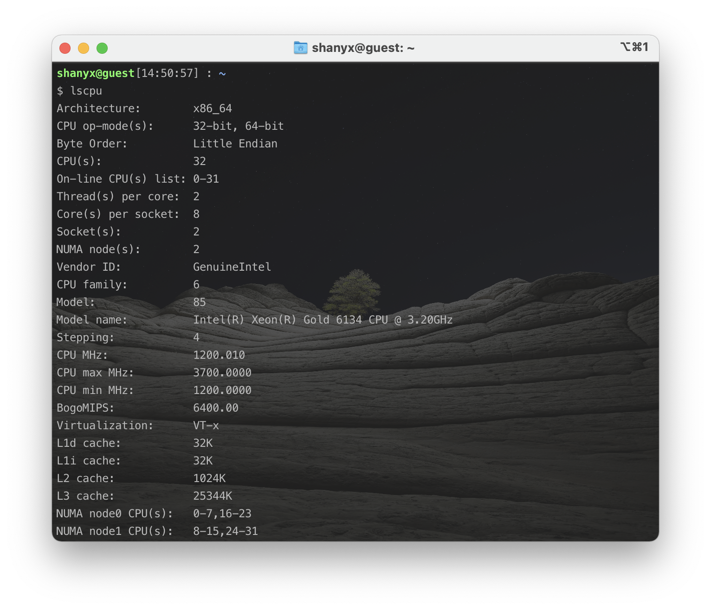

<h1 align=center>中山大学数据科学与计算机学院本科生实验报告</h1>

<h1 align=center>（2020 学年秋季学期）</h1>

<h1 align=center>实验七</h1>

   <h2 align=center>课程名称：高性能计算程序设计               任课教师：黄聃</h2>

| 年级+班级 |   18级计科（超算）   | 专业（方向） | 计算机科学与技术（超级计算方向） |
| :-------: | :------------------: | :----------: | :------------------------------: |
|   学号    |       18340052       |     姓名     |               何泽               |
|   Email   | heze_heze@icloud.com |   完成日期   |           2021年1月9日           |

 <h2 align=center>目录</h2>

[TOC]

# Ⅰ  实验目的

## 1. 通过 CUDA 实现CNN

> 在信号处理、图像处理和其他工程/科学领域，卷积是一种使用广泛的技术。在深度学习领域，卷积神经网络(CNN)这种模型架构就得 名于这种技术。在本实验中，我们将在 GPU 上实现卷积操作，注意 这里的卷积是指神经网络中的卷积操作，与信号处理领域中的卷积 操作不同，它不需要对 Filter 进行翻转，不考虑 bias。
>
> 任务一通过 CUDA 实现直接卷积(滑窗法)，输入从 256 增加至 4096或者输入从 32 增加至 512.
>
> 输入:Input 和 Kernel(3x3)
>
> 问题描述:用直接卷积的方式对 Input 进行卷积，这里只需要实现 2D, height\*width，通道 channel(depth)设置为 3，Kernel (Filter)大小设置 为 3\*3\*3，个数为 3，步幅(stride)分别设置为 1，2，3，可能需要通 过填充(padding)配合步幅(stride)完成 CNN 操作。注:实验的卷积操 作不需要考虑 bias(b)，bias 设置为 0.
>
> 输出:输出卷积结果以及计算时间

## 2. 使用 im2col 方法结合上次实验实现的 GEMM 实现卷积操作

>使用 im2col 方法结合上次实验实现的 GEMM 实现卷积操作。
>
>输入从 256 增加至 4096 或者输入从 32 增加至 512
>
>输入:Input 和 Kernel (Filter)
>
>问题描述:用 im2col 的方式对 Input 进行卷积，这里只需要实现 2D, height\*width，通道 channel(depth)设置为 3，Kernel (Filter)大小设置 为 3\*3\*3，个数为 3。 注:实验的卷积操作不需要考虑 bias(b)，bias 设置为 0，步幅(stride)分别设置为 1，2，3。
>
>输出:卷积结果和时间。

## 3. 使用cuDNN进行卷积

> NVIDIA cuDNN 是用于深度神经网络的 GPU 加速库。它强调性能、易用性和低内存开销。
>
> 使用 cuDNN 提供的卷积方法进行卷积操作，记录其相应 Input 的卷 积时间，与自己实现的卷积操作进行比较。如果性能不如 cuDNN， 用文字描述可能的改进方法。

# Ⅱ   实验过程和核心代码

## 1. 通过 CUDA 实现CNN

### （1） 前置结构说明

- 首先，矩阵维度2个参数和Kernel维度由运行时输入参数argv列表获得

    ```c
    int W=atoi(argv[1]);
    int H=atoi(argv[2]);
    int KERNEL_SIZE=atoi(argv[3]);
    ```
    
- 计时我使用的是`cudaEventRecord`记录

    ```c++
    float time;
    cudaEvent_t start, stop;
    cudaEventCreate(&start);
    cudaEventCreate(&stop);
    cudaEventRecord(start, 0);
    //在这里计算
    cudaEventRecord(stop, 0);
    cudaEventSynchronize(stop);
    cudaEventElapsedTime(&time, start, stop);
    ```

    上面的代码中最后的time即为程序运行时间。

### （2） CUDA版本CNN

#### ①核函数，二维卷积

```c
__global__ void Conv2DKernel(float *output, float *input, float *kernel, int inputSize, int kernelSize)
{
    int col = threadIdx.x + blockDim.x * blockIdx.x;
    int row = threadIdx.y + blockDim.y * blockIdx.y;
    // 边界检查, 0 ~ inputSize - kernelSize + 1
    const int limit = inputSize - kernelSize + 1;
    if (col >= limit || row >= limit)
        return;
    int curCol = 0;
    int curRow = 0;
    float sum = 0.0f;
    for (int i = 0; i < kernelSize; ++i){
        for (int j = 0; j < kernelSize; ++j){
            curCol = col + j;
            curRow = row + i;
            sum += (kernel[i * kernelSize + j] * input[curRow * inputSize + curCol]);
        }
    }
    output[row * limit + col] = sum;
}
```

#### ②main函数

- 首先，打印矩阵的函数

    ```c
    void display(float *arr, int w, int h)
    {
        for (int i = 0; i < w; ++i){
            for (int j = 0; j < h; ++j){
                printf("%d\t", int(arr[i * w + j]));
            }
            printf("\n");
        }
        printf("\n");
    }
    ```

- 随机产生某个范围内值的函数

    ```c
    int rand_num(int start, int end)
    {
        return rand() % (end + 1 - start) + start;
    }
    ```
    
- 在Host端分配内存

    ```c
    float *h_A = (float *)malloc(mSize);
    float *h_Kernel = (float *)malloc(KERNEL_SIZE * KERNEL_SIZE * sizeof(float));
    float *h_C = (float *)malloc(convOutSize * sizeof(float));
    ```
    
- 在Device端为A和B分配内存

    ```c
    float *d_A = NULL;
    float *d_Kernel = NULL;
    cudaMalloc(&d_A, mSize);
    cudaMalloc(&d_Kernel, KERNEL_SIZE * KERNEL_SIZE * sizeof(float));
    ```

- 将A和Kernel从host端拷贝到Device端

    ```c
    cudaMemcpy(d_A, h_A, mSize, cudaMemcpyHostToDevice);
    cudaMemcpy(d_Kernel, h_Kernel, KERNEL_SIZE * KERNEL_SIZE * sizeof(float), cudaMemcpyHostToDevice);
    ```

- 启动kernel计算

    ```c
    dim3 dimBlock(TB, TB);
    int tb = (W + TB - 1) / TB;
    dim3 dimGrid(tb, tb);
    
    cudaEventRecord(start, 0);
    Conv2DKernel<<<dimGrid, dimBlock>>>(d_C, d_A, d_Kernel, W, KERNEL_SIZE);
    cudaEventRecord(stop, 0);
    cudaEventSynchronize(stop);
    cudaEventElapsedTime(&time_gpu, start, stop);
    ```

- 将计算结果从Device端复制回Host端

    ```c
    cudaMemcpy(h_C, d_C, convOutSize * sizeof(float), cudaMemcpyDeviceToHost);
    ```

- 释放内存

    ```c
    cudaFree(d_A);
    cudaFree(d_Kernel);
    cudaFree(d_C);
    free(h_A);
    free(h_Kernel);
    free(h_C);
    ```

## 2. 使用 im2col 方法结合上次实验实现的 GEMM 实现卷积操作

- 参数含义：

    ```c
    //             : Height          : Width           : Channels  :
    // INPUT   / A | H               | W               | C         | 
    // KERNELS / F | P = K           | Q = K           | R = C     |
    // OUTPUT  / B | L = H * (K - 1) | M = W * (K - 1) | N = D = 1 |
    ```

- im2col核函数

    ```c
    __global__ void im2colOnDevice(unsigned int n, float *matAc, float *matA, int radiusF, int countF, int L, int M, int K, int C,int H)
    {
        for (int idx = blockIdx.x * blockDim.x + threadIdx.x; idx < n; idx += blockDim.x * gridDim.x) {
            int m = (idx / C) / L;
            int l = (idx / C) % L;
            int r = idx % C;
            if (m < M) {
                int w = m + radiusF;
                if (l < L) {
                    int h = l + radiusF;
                    // For each kernel weight...
                    for (int q = 0, oq = -1 * radiusF; oq <= radiusF; q++, oq++) {
                        for (int p = 0, op = -1 * radiusF; op <= radiusF; p++, op++) {
                            if (r < C) {
                                matAc[(r + C * (p + K * q)) + countF * (l + L * m)] = matA[r + C * ((h + op) + H * (w + oq))]; 
                            }
                        }
                    }
                }
            }
        }
    }
    ```

- gemm核函数

    ```c
    __global__ void gemm_gpu(double *a,double *b, double *c, int m, int n, int k)
    { 
       int row = blockIdx.y * blockDim.y + threadIdx.y; 
       int col = blockIdx.x * blockDim.x + threadIdx.x;
       double tmp = 0;
       if( col < k && row < m) {
           for(int i = 0; i < n; i++) {
               tmp += a[row * n + i] * b[i * k + col];
           }
           c[row * k + col] = tmp;
       }
    }
    ```

其余部分与之前接近。

## 3.使用cuDNN进行卷积

- 首先要有下面的define

    ```c
    #define CUDA_CALL(f) { \
        cudaError_t err = (f); \
        if (err != cudaSuccess) { \
          std::cout \
              << "    Error occurred: " << err << std::endl; \
          std::exit(1); \
        } \
    }
       
    #define CUDNN_CALL(f) { \
        cudnnStatus_t err = (f); \
        if (err != CUDNN_STATUS_SUCCESS) { \
          std::cout \
              << "    Error occurred: " << err << std::endl; \
          std::exit(1); \
        } \
    }
    ```

- 两个需要用到的核函数

    ```c
    __global__ void dev_const(float *px, float k) {
        int tid = threadIdx.x + blockIdx.x * blockDim.x;
        px[tid] = k;
    }
     
    __global__ void dev_iota(float *px) {
        int tid = threadIdx.x + blockIdx.x * blockDim.x;
        px[tid] = tid;
    }
    ```

- 初始化

    ```c
    cudnnHandle_t cudnn;
    float time_gpu;
    cudaEvent_t start, stop;
    cudaEventCreate(&start);
    cudaEventCreate(&stop);
    CUDNN_CALL(cudnnCreate(&cudnn));
    ```

- 输入矩阵

    ```c
    const int in_n = 1;
    const int in_h = atoi(argv[1]);
    const int in_w = atoi(argv[2]);
    const int in_c = atoi(argv[3]);
    
    cudnnTensorDescriptor_t in_desc;
    CUDNN_CALL(cudnnCreateTensorDescriptor(&in_desc));
    CUDNN_CALL(cudnnSetTensor4dDescriptor(in_desc, CUDNN_TENSOR_NCHW, CUDNN_DATA_FLOAT,in_n, in_c, in_h, in_w));
    
    float *in_data;
    CUDA_CALL(cudaMalloc(&in_data, in_n * in_c * in_h * in_w * sizeof(float)));
    ```

- filter

    ```c
    const int filt_k = 1;
    const int filt_c = 3;
    const int filt_h = 3;
    const int filt_w = 3;
    
    cudnnFilterDescriptor_t filt_desc;
    CUDNN_CALL(cudnnCreateFilterDescriptor(&filt_desc));
    CUDNN_CALL(cudnnSetFilter4dDescriptor(filt_desc, CUDNN_DATA_FLOAT, CUDNN_TENSOR_NCHW,filt_k, filt_c, filt_h, filt_w));
    
    float *filt_data;
    CUDA_CALL(cudaMalloc(&filt_data, filt_k * filt_c * filt_h * filt_w * sizeof(float)));
    ```

- 卷积要用到的参数

    ```c
    const int pad_h = 1;
    const int pad_w = 1;
    const int str_h = 1;
    const int str_w = 1;
    const int dil_h = 1;
    const int dil_w = 1;
    
    cudnnConvolutionDescriptor_t conv_desc;
    CUDNN_CALL(cudnnCreateConvolutionDescriptor(&conv_desc));
    CUDNN_CALL(cudnnSetConvolution2dDescriptor(
        conv_desc,
        pad_h, pad_w, str_h, str_w, dil_h, dil_w,
        CUDNN_CONVOLUTION, CUDNN_DATA_FLOAT));
    ```

- 存放结果

    ```c
    int out_n;
    int out_c;
    int out_h;
    int out_w;
    
    CUDNN_CALL(cudnnGetConvolution2dForwardOutputDim(
        conv_desc, in_desc, filt_desc,
        &out_n, &out_c, &out_h, &out_w));
    
    cudnnTensorDescriptor_t out_desc;
    CUDNN_CALL(cudnnCreateTensorDescriptor(&out_desc));
    CUDNN_CALL(cudnnSetTensor4dDescriptor(
        out_desc, CUDNN_TENSOR_NCHW, CUDNN_DATA_FLOAT,
        out_n, out_c, out_h, out_w));
    
    float *out_data;
    CUDA_CALL(cudaMalloc(
        &out_data, out_n * out_c * out_h * out_w * sizeof(float)));
    ```

- 设定算法和workspace

    ```c
    cudnnConvolutionFwdAlgo_t algo;
    CUDNN_CALL(cudnnGetConvolutionForwardAlgorithm(
        cudnn,
        in_desc, filt_desc, conv_desc, out_desc,
        CUDNN_CONVOLUTION_FWD_PREFER_FASTEST, 0, &algo));
    
    size_t ws_size;
    CUDNN_CALL(cudnnGetConvolutionForwardWorkspaceSize(
        cudnn, in_desc, filt_desc, conv_desc, out_desc, algo, &ws_size));
    
    float *ws_data;
    CUDA_CALL(cudaMalloc(&ws_data, ws_size));
    ```

- 计算

    ```c
    float alpha = 1.f;
    float beta = 0.f;
    dev_iota<<<in_w * in_h, in_n * in_c>>>(in_data);
    dev_const<<<filt_w * filt_h, filt_k * filt_c>>>(filt_data, 1.f);
    cudaEventRecord(start, 0);
    CUDNN_CALL(cudnnConvolutionForward(
        cudnn,
        &alpha, in_desc, in_data, filt_desc, filt_data,
        conv_desc, algo, ws_data, ws_size,
        &beta, out_desc, out_data));
    cudaEventRecord(stop, 0);
    cudaEventSynchronize(stop);
    cudaEventElapsedTime(&time_gpu, start, stop);
    ```

- 最后清理内存

    ```c
    CUDA_CALL(cudaFree(ws_data));
    CUDA_CALL(cudaFree(out_data));
    CUDNN_CALL(cudnnDestroyTensorDescriptor(out_desc));
    CUDNN_CALL(cudnnDestroyConvolutionDescriptor(conv_desc));
    CUDA_CALL(cudaFree(filt_data));
    CUDNN_CALL(cudnnDestroyFilterDescriptor(filt_desc));
    CUDA_CALL(cudaFree(in_data));
    CUDNN_CALL(cudnnDestroyTensorDescriptor(in_desc));
    CUDNN_CALL(cudnnDestroy(cudnn));
    ```

# Ⅲ  实验结果

## 0. 运行环境与硬件

- CPU：

    

- GPU与CUDA版本：

    


## 1. 通过 CUDA 实现CNN

### （1） 验证算法正确性

​		找了网络上的测例，结果正确：


然后随机计算了2组，经验证，结果也正确：


### （2） 改变维数并记录时间


## 2.使用 im2col 方法结合上次实验实现的 GEMM 实现卷积操作


可以看出时间较前面稍有缩短。

## 3. 使用cuDNN进行卷积

- 首先小维度，经验证结果是正确的：

    
  
- 改变维度：

    
  
  可以看出相较于前面两个速度有提升。


# Ⅳ  实验感想

此次实验主要是在GPU上实现CNN卷积操作，通过三种不同的方式，熟悉了卷积的流程与方法，其次也对CUDA编程有了更深入的体会。

